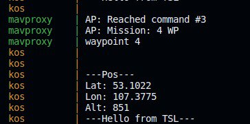

# Квалификационное задание

Этапы и основные пункты выполнения задания

## Задача

Описание задачи из репозитория доступно по [ссылке](https://github.com/cyberimmunity-edu/cyberimmune-systems-autonomous-delivery-drone-with-kos/blob/main/docs/QUALIFICATION.md#%D0%B2%D1%8B%D0%B2%D0%B5%D1%81%D1%82%D0%B8-%D0%BE%D1%82%D0%BE%D0%B1%D1%80%D0%B0%D0%B6%D0%B5%D0%BD%D0%B8%D0%B5-%D0%BA%D0%BE%D0%BE%D1%80%D0%B4%D0%B8%D0%BD%D0%B0%D1%82-%D0%B8-%D0%B2%D1%8B%D1%81%D0%BE%D1%82%D1%8B-%D0%BC%D0%B5%D1%81%D1%82%D0%BE%D0%BF%D0%BE%D0%BB%D0%BE%D0%B6%D0%B5%D0%BD%D0%B8%D1%8F-%D0%BA%D0%B2%D0%B0%D0%B4%D1%80%D0%BE%D0%BA%D0%BE%D0%BF%D1%82%D0%B5%D1%80%D0%B0-%D0%B2-%D0%B4%D0%B0%D0%BD%D0%BD%D1%8B%D0%B9-%D0%BC%D0%BE%D0%BC%D0%B5%D0%BD%D1%82).


1. Ознакомиться с [программным интерфейсом](https://github.com/cyberimmunity-edu/cyberimmune-systems-autonomous-delivery-drone-with-kos/blob/main/docs/API.md) бортового модуля безопасности
2. Используя вызовы программного интерфейса, отобразить в текстовом выводе координаты и высоту местоположения квадрокоптера в каждый момент (не чаще раза в секунду)

## Краткое описание решения

Для выполнения задания был изменён код модуля безопасности [KOS](https://github.com/ve-dima/cyberimmune-systems-autonomous-delivery-drone-with-kos-sfedu/tree/main/kos). В цикле, выполняющемся после получения команды *ARM*, мы добавили вызов функции [getCoords](https://github.com/cyberimmunity-edu/cyberimmune-systems-autonomous-delivery-drone-with-kos/blob/main/docs/API.md#int-getcoordsint32_t-latitude-int32_t-longitude-int32_t-altitude) из программного интерфейса компонента безопасности. Затем, в соответствии с документацией, широта и долгота были переведены в градусы, а высота - в метры.

## Код, выполняющий поставленную задачу

Ознакомиться с кодом можно в файле ```kos/flight_controller/src/main.cpp``` или в [коммите](https://github.com/ve-dima/cyberimmune-systems-autonomous-delivery-drone-with-kos-sfedu/commit/906008416624b538f8d3e0c4e431a537f3230569).

```
 while (true)
    {
        int32_t lat, lon, alt;
        getCoords(lat, lon, alt);
        fprintf(stderr, "\n\n---Pos---\nLat: %.4f\nLon: %.4f\nAlt: %2.f\n---Hello from TSL---\n\n",
                lat * 1e-7, lon * 1e-7, alt * 1e-2);
        sleep(2);
    }
```

## Подтверждение
Ниже представлен скриншот из консоли, где модно увидеть сообщение при выполнении БПЛА полётного задания.

